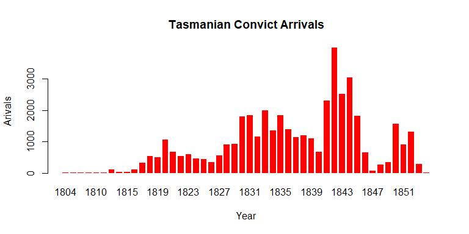

# Tasmanian Convict Data Visualisations


All graphs were produced using R and a few were further refined using Adobe Illustrator. Please forgive the average quality of prototype plots – R doesn’t do a very good job at exporting images.

While creating all the following graphics, I tried to keep some of Edward Tufte’s principles for graphical integrity in mind. 

In my opinion, the most important are:
+ Inducing the viewer to “think about the substance rather than methodology, graphic design or technology of graphic design”
+ “Avoid distorting what the data have to say”
+ "Show data variation - not design variation"
+ Maximising “data-ink ratio” – or to "prune out ink that fails to present fresh data-information"
+ Avoiding “chartjunk”

Some of the graphics are also quite similar to the style of Flowing Data’s graphics, this is mainly because I used the same R base graphics library which Nathan Yau uses for Flowing Data, and some of the graphics were inspired by examples in his book “Visualise This”.

## Convict Arrivals per Year

```r
arrivals.byyear<-data.frame(xtabs(~shipyear,convicts))

barplot(arrivals.byyear$Freq, names.arg=arrivals.byyear$shipyear, main="Tasmanian Convict Arrivals", 
        ylab = "Arivals", xlab="Year", col="red", border = NA, space =0.3)
```



Quite a large amount of variability between years. I find this graph quite aesthetically pleasing and also informative.

## Convict Age and Arrival Year

```r
meanage.byyear<-aggregate(arrivage~shipyear,convicts,mean)

# Remove year 1854 - only 1 arrival in that year
meanage.byyear<-meanage.byyear[-48,]
barplot(meanage.byyear$arrivage, names.arg=meanage.byyear$shipyear, main="Tasmanian Convict Age", 
        ylab = "Mean Age", xlab="Year", col="red", border = NA, space =0.3)
```


 
Extremely uninteresting result. The variation in mean age in the earlier years is only due to the small sample sizes for those years.

I then tried to split the convicts up into 3 trade categories and then recreated arrivals per year bar chart.  
The following plots use colour schemes from colorbrewer2.org.

```r
Arrivals by year, split by occupation (colour scheme 1)
keep <- c("Agricultural worker", "Labourer and unskilled")
convicts$TradeCat.reduce<-as.character(convicts$TradeCat)
convicts$TradeCat.reduce[!(convicts$TradeCat %in% keep)]<-c("Other")

convicts$TradeCat.reduce<-as.factor(convicts$TradeCat.reduc)

arrivals.year.tradered<-t(xtabs(~shipyear+TradeCat.reduce,convicts))
barplot(arrivals.year.tradered, main="Tasmanian Convict Arrivals", 
        ylab = "Arivals", xlab="Year", col=c("#1d91c0","#7fcdbb","#c7e9b4"), border = NA, space =0.3)

legend("topleft", rev(rownames(arrivals.year.tradered)), fill=rev(c("#1d91c0","#7fcdbb","#c7e9b4")), 
       title = "Occupation",  border=FALSE, box.col=FALSE)
 
Arrivals by year, split by occupation (colour scheme 2)
barplot(arrivals.year.tradered, main="Tasmanian Convict Arrivals", 
        ylab = "Arivals", xlab="Year", col=c("#ae017e","#dd3497","#fa9fb5"), border = NA, space =0.3)

legend("topleft", rev(rownames(arrivals.year.tradered)), fill=rev(c("#ae017e","#dd3497","#fa9fb5")), 
       title = "Occupation",  border=FALSE, box.col=FALSE)
```


 
Pretty, but not any more informative than the first bar chart which only showed convict arrivals over years.

## Pairs matrix

According to Edward Tufte – scatter plots are good at "encouraging and even imploring the viewer to assess the possible causal relationships". 

The pairs matrix is probably one of the most informative graphs you can possible make. It is also non-reductive in nature, as it allows each data point to be displayed without any generalisation or reduction in detail. 

```r
convicts.continuousvars<-data.frame(height=convicts$height, shipyear=convicts$shipyear, arrivage=convicts$arrivage)

pairs(convicts.continuousvars, panel=panel.smooth, pch=19, cex=.01, col="#444444")
```


 
Because arrive age and year are only integers, there is a massive amount of overlap between points in each scatter plot. The jitter function introduces random normally distributed noise into the data - which somewhat naturally simulates the actual values of the data points (especially age - which is reasonably evenly distributed)

## Pairs matrix with jitter

```r
pairs(lapply(convicts.continuousvars, jitter, 5), panel=panel.smooth, pch=19, cex=.01, col="#888888")
```


 
The graphs are now much more aesthetically interesting, but there aren't any really interesting relationships among the continuous variables. The relationship between age and height it a little too obvious - I don't any new insights into age/height can be gained from further plotting. The relationship between arrival age and year looks a bit more interesting.

## Scatter plot with jitter – Convict Arrive Year vs Age

```r
plot(jitter(convicts.complete$shipyear,5),jitter(convicts.complete$arrivage,5), pch=19, cex=0.05, col="black", main="Convict Age vs Height", xaxt='n', yaxt='n', xlab="Year", ylab="Age", bty="n")
lines(loess.smooth(convicts.complete$shipyear,convicts.complete$arrivage), col="#aa0000", cex=1)

x.ticks<-seq(min(convicts.complete$shipyear), max(convicts.complete$shipyear), 10)+1
y.ticks<-seq(min(convicts.complete$arrivage), max(convicts.complete$arrivage), 15)+1

axis(1, x.ticks, x.ticks, lwd=0, tck=-0.02, lwd.ticks=1)
axis(2, y.ticks, y.ticks, lwd=0, tck=-0.02, lwd.ticks=1)
```


I really like this plot. It's unfortunate that the relationship between age and year is quite plain (showed by the red LOESS line), but there is some interesting variability in the distribution of age over the years.
I then refined the plot in Adobe Illustrator.


 
The added transparency allows the clustered dots to generate a sort of heatmap, which almost shows the distribution of points along each variable.

## Marginal Plot

This just the previous plot with marginal density lines attached (lines which show the distribution both variables). I am a little bit obsessed with this kind of plot, I find it extremely visually appealing and also extremely informative.

```r
x <- jitter(convicts.complete$shipyear,5)
y <- jitter(convicts.complete$arrivage,5)

d.x <- density(convicts.complete$shipyear) 
d.y <- density(convicts.complete$arrivage)

par(fig=c(0,0.8,0,0.8), new=FALSE)
plot(x,y, xlim=range(x), ylim=range(y),  pch=19, cex=0.05, col="black", main="", xaxt='n', yaxt='n', xlab="Year", ylab="Age", bty="n") 
lines(loess.smooth(convicts.complete$arrivage,convicts.complete$shipyear), col="#aa0000", cex=1)

x.ticks<-seq(min(convicts.complete$shipyear), max(convicts.complete$shipyear), 10)+1
y.ticks<-seq(min(convicts.complete$arrivage), max(convicts.complete$arrivage), 15)+1

axis(1, x.ticks, x.ticks, lwd=0, tck=-0.02, lwd.ticks=1)
axis(2, y.ticks, y.ticks, lwd=0, tck=-0.02, lwd.ticks=1)

par(fig=c(0,0.8,0.55,1), new=TRUE)
plot(d.x$x, d.x$y, xlim=range(x), type='l', xaxt='n', yaxt='n', main="", xlab = "", ylab="", bty="n", frame.plot=FALSE) 

par(fig=c(0.65,1,0,0.8),new=TRUE)
plot(-d.y$y, d.y$x, ylim=range(y), xlim=-range(d.y$y), type='l', xaxt='n', yaxt='n', main="", xlab = "", ylab="", bty="n", frame.plot=FALSE) 
mtext("Convict Age vs Year", side=3, outer=TRUE, line=-3)
```


 
The R graph is a bit ugly, as it was hard to get the proportions right, Illustrator allowed me to refine the plot with much more control.


 
I really like this chart.

## Bubble charts

I’m not a big fan of bubble charts, but it is incredibly hard to find an efficient way of encoding 3 dimensions of data in a clear and easily interpreted way, and bubble charts nearly succeed in doing this.

### Bubble chart setup

```r
Tradecat.totals<-data.frame(arrivage=aggregate(arrivage~TradeCat,convicts.complete,mean)$arrivage, 
                            shipyear=aggregate(shipyear~TradeCat,convicts.complete,mean)$shipyear,
                            height=aggregate(height~TradeCat,convicts.complete,mean)$height,
                            totalarrivals=as.vector(xtabs(~TradeCat, data=convicts.complete))[-1])

# Remove NA
Tradecat.totals<-Tradecat.totals[-1,]
rownames(Tradecat.totals)<-sort(unique(convicts.complete$TradeCat))[-1]

Tradecat.totals <- Tradecat.totals[order(Tradecat.totals$totalarrivals, decreasing = TRUE),]
Bubble chart - Convict trades with Mean Age and Mean Arrival Year
radius<-sqrt(Tradecat.totals$totalarrivals/pi)
symbols(Tradecat.totals$arrivage, Tradecat.totals$shipyear, circles=radius, inches = 0.65, fg="white", bg="red", xlab="Average Age", ylab = "Average Arrival Year")
text(Tradecat.totals$arrivage, Tradecat.totals$shipyear, rownames(Tradecat.totals), cex=.75)
```


 
I think this plot is uninteresting and confusing. I would prefer the arrival year to be plotted on the x axis, but for the labels to be readable they must be evenly distributed vertically (or they can overlap). Either way I think the data is too boring to justify further refining the plot.

## Bubble chart - Convict First names with Mean Age and Mean Arrival Year

Note: the circles in the bottom right are the legend, it is too hard to position them correctly in R - so they've been positioned in Illustrator.

```r
gname.counts <- data.frame(xtabs(~gname, convicts))

gname.g100.counts <- gname.counts[gname.counts$Freq>230,]

convicts.gname.g100 <- convicts.complete[convicts.complete$gname %in% gname.g100.counts$gname,]

convicts.bygname.g100<-data.frame(arrivage=aggregate(arrivage~gname,convicts.gname.g100,mean)$arrivage, 
                            shipyear=aggregate(shipyear~gname,convicts.gname.g100,mean)$shipyear,
                            totalnames=gname.g100.counts$Freq)
rownames(convicts.bygname.g100)<-gname.g100.counts$gname

convicts.bygname.g100 <- convicts.bygname.g100[order(convicts.bygname.g100$totalnames, decreasing = TRUE),]

radius<-sqrt(convicts.bygname.g100$totalnames/pi)
symbols(convicts.bygname.g100$shipyear, convicts.bygname.g100$arrivage, circles=radius, inches = 0.65, fg="white", bg="red", ylab="Average Age", xlab = "Average Arrival Year", main="Top 20 Convict Names")
text(convicts.bygname.g100$shipyear, convicts.bygname.g100$arrivage, rownames(convicts.bygname.g100), cex=.75)

legend.bubbles<-c(5000,2000,500)
symbols(rep(max(convicts.bygname.g100$shipyear),3), rep(min(convicts.bygname.g100$arrivage),3), circles=sqrt(legend.bubbles/pi), inches = 0.65, fg="white", bg="red",add=TRUE)
text(rep(max(convicts.bygname.g100$shipyear),3), rep(min(convicts.bygname.g100$arrivage),3), as.character(legend.bubbles), cex=.75)
```


  
This plot is much more successful than the last. Although, I still feel that the data isn't that interesting. The number of convicts with certain first names is interesting, but the average arrival year and average age axes are completely redundant. The average age values range from 24.5 to 27 and the average year only ranges from 1836 to 1840. The only reason the axes are included is that it provides a nice variation in circle position and it would be a waste to only plot the circles without any other information.


 
While I think this graph is quite engaging, it doesn’t really offer any new interesting insights into the dataset.

## Density Matrix - Convict Arrivals split by Trade

Edward Tufte defines "small multiples" as "like frames of movie - a series of graphics, showing the same combination of variables, indexed by changes in another variable (i.e. time)". He says that well-designed small multiples can be “narrative in context, showing shifts in the relationships between variables as the index variable changes”.
The following graph is an example of small multiples. I believe it to be a quite engaging example while also keeping the data the integral focus of the graphic. The first graph contains a separate density plot of convict arrivals for each convict trade category.

```r
tradeCats<-sort(unique(convicts$TradeCat))[-1]

x=par(mfrow=c(length(tradeCats)+1,1), mai = c(0, 0, 0.1, 0))
for(trade in tradeCats) {
  density.year.bytrade<-density(convicts[convicts$TradeCat==trade,]$shipyear)
  plot(density.year.bytrade, type="n", main="",  bty="n" ,xaxt="n", yaxt="n", xlab="", ylab="")
  
  polygon(density.year.bytrade, col = "#aaaaaa", border=F)
  title(trade, line = -2, adj=0)
}

x.ticks<-seq(min(convicts.complete$shipyear), max(convicts.complete$shipyear), 10)+1
axis(1, x.ticks, x.ticks, lwd=0, tck=-0.02, lwd.ticks=1)

mtext("Arrival Year", side=1, outer=TRUE, line=-1, cex = 0.75)

par(x)
```


 
I believe that this kind of plot has potential, it does need some further refining in order to be as easy to interpret as possible.
The next example shows the distribution of convict arrival ages for each year.

## Density Matrix - Age by Year

```r
years<-seq(1816, 1853, 1)

x=par(mfrow=c(length(years)+1,1), mai = c(0, 0, 0.05, 0))
for(year in years) {
  density.age.byyear<-density(convicts[convicts$shipyear==year,]$arrivage)
  plot(density.age.byyear, type="n", main="", bty="n" ,xaxt="n", yaxt="n", xlab="", ylab="")
  
  polygon(density.age.byyear, col = "#aaaaaa", border=F)
  title(year, line = -2, adj=0)
}

x.ticks<-seq(min(convicts.complete$arrivage), max(convicts.complete$arrivage), 10)+1
axis(1, x.ticks, x.ticks, lwd=0, tck=-0.02, lwd.ticks=1)

mtext("Convict Age", side=1, outer=TRUE, line=-1, cex = 0.75)

par(x)
```


 
I do find this graph quite visually appealing, but I feel that there isn’t quite enough variation between convict age vs year to create a truly interesting graph. 

## Linegraph matrix - Convict Trades

This graph uses the same data as the first “Density matrix” graph. I much prefer lines over filled-in polygons.

```r
tradeCats<-sort(unique(convicts$TradeCat))[-1]

x=par(mfrow=c(length(tradeCats)+1,1), mai = c(0, 0, 0.1, 0))
for(trade in tradeCats) {
  density.year.bytrade<-density(convicts[convicts$TradeCat==trade,]$shipyear)
  plot(density.year.bytrade, type="l", main="",  bty="n" ,xaxt="n", yaxt="n", xlab="", ylab="", zero.line=FALSE)
  
  title(trade, line = -2, adj=0)
}

x.ticks<-seq(min(convicts.complete$shipyear), max(convicts.complete$shipyear), 10)+1
axis(1, x.ticks, x.ticks, lwd=0, tck=-0.02, lwd.ticks=1)

mtext("Arrival Year", side=1, outer=TRUE, line=-1, cex = 0.75)

par(x)
```


## Linegraph matrix - Convict Trades with max year

This graph is an extension of the previous graph. I have added a small marker which indicates the maximum number of arrivals for each trade on a given year. I believe that it provides that a needed context to each individual line, as it gives you some sense of the total number of convicts in each trade.

```r
tradeCats<-sort(unique(convicts$TradeCat))[-1]
arrivals.year.trade.df<-data.frame(t(xtabs(~shipyear+TradeCat,convicts)))

x=par(mfrow=c(length(tradeCats)+1,1), mai = c(0, 0, 0.1, 0))
for(trade in tradeCats) {
  yearly.trade.data<-subset(arrivals.year.trade.df, TradeCat==trade)
  max.year.trade <- yearly.trade.data[order(yearly.trade.data$Freq, decreasing = TRUE)[1],]
  
  density.year.bytrade<-density(convicts[convicts$TradeCat==trade,]$shipyear)
  
  plot(density.year.bytrade, type="l", main="",  bty="n" ,xaxt="n", yaxt="n", xlab="", ylab="", zero.line=FALSE)
  
  text(density.year.bytrade$x[order(density.year.bytrade$y, decreasing = TRUE)[1]],
       max(density.year.bytrade$y)/2, max.year.trade$Freq, pch=20)
  
  par(new=TRUE)
  
  plot(density.year.bytrade$x[order(density.year.bytrade$y, decreasing = TRUE)[1]],
       max(density.year.bytrade$y), type="p",  bty="n" ,xaxt="n", yaxt="n", xlab="", ylab="", pch=20,
       ylim=range(density.year.bytrade$y), xlim=range(density.year.bytrade$x), col="red")
  
  par(new=FALSE)
  
  title(trade, line = -.5, adj=0)
  
}

x.ticks<-seq(min(convicts.complete$shipyear), max(convicts.complete$shipyear), 10)
axis(1, x.ticks, x.ticks, lwd=0, tck=-0.02, lwd.ticks=1)

mtext("Arrival Year", side=1, outer=TRUE, line=-1, cex = 0.75)

par(x)
```


 
I then used Illustrator to refine this graphic.


 
This is definitely my favourite graphic that I have made for this unit. It could be improved if a small total was added to the right of each plot. And I’m not that happy with how everything is aligned.

I think that there is potential for the graph to be misinterpreted, as the line represents the distribution of convict arrivals over the years and the red marker indicates the highest arrival rate in a given year for each trade. The density line gives the impression that the data is continuous, whereas it is discrete – it only represents convict arrivals on a year-by-year scale.  

## Trade Treemap

```r
#install.packages("treemap", dependencies = TRUE)
library(treemap)

trade.df <- data.frame(xtabs(~trade, convicts))

trade.df$TradeCat<-with(convicts, TradeCat[match(trade.df$trade, trade)])

treemap(trade.df, index=c("TradeCat", "trade"), vSize="Freq")
```


 
### Cut off at 2 convicts per trade

I cut off trades which had less than 2 convicts to reduce the number of small boxes.

```r
trade.cutoff<-2
trade.df.reduced <- rbind(trade.df[trade.df$Freq>=trade.cutoff,], data.frame(trade="Other", TradeCat="Other", Freq=sum(trade.df[trade.df$Freq<trade.cutoff,]$Freq)))

treemap(trade.df.reduced, index=c("TradeCat", "trade"), vSize="Freq")
```


 
I do quite like this and I believe that it does a good job at showing a large number of convict trades, how they can be organised into categories and the trade’s relative proportion, but it is too hard to read. It would take a very long time to refine and get up to scratch in Illustrator

## Trades by year - multiple line graph

```r
trades.g100<-trade.df[trade.df$Freq>=500,]$trade

arrivals.year.trade.df<-data.frame(t(xtabs(~shipyear+trade,convicts[convicts$trade %in% trades.g100, ])))

largestTrade<-as.character(trade.df[order(trade.df$Freq, decreasing = TRUE)[1],]$trade)
largestTrade.lineData<-subset(arrivals.year.trade.df, trade==largestTrade)

largestTrade.years <-as.numeric(largestTrade.lineData$shipyear)
largestTrade.arrivals <-largestTrade.lineData$Freq

plot(loess.smooth(y=largestTrade.arrivals,x=largestTrade.years), type="n", col="#ff0000", lwd=1, lend=2, 
     main="Convict Arrivals by Trade", xlab="Year", ylab="Arrivals", xaxt='n')

rapply.max <- function(x) {
  return(max(0,x))
}

for (current.trade in trades.g100) {
  data.line<-subset(arrivals.year.trade.df, trade==current.trade)
  loess.line<-loess.smooth(y=data.line$Freq,x=as.numeric(data.line$shipyear))
  loess.line$y<-lapply(loess.line$y, function(x) {max(0,x)})
  lines(loess.line, col=rgb(0,0,0,alpha=0.25), lwd=1, lend=2)
  text(tail(loess.line$x, n=1), tail(loess.line$y, n=1), current.trade, cex=0.5)
}

axis(1, at=largestTrade.years, labels=largestTrade.lineData$shipyear, tick = FALSE)
 
Data is too boring and there are too many overlapping lines.
Age by year - multiple line graph
These graphs contain lines for each convict age (in years) which represent the distribution of yearly convict arrivals for that particular age.
library(RColorBrewer)

multiLineTradePlot <- function(color.string, color.bias=1, rev.ages.print=FALSE, rev.colors=FALSE) {
  
  age.df <- data.frame(xtabs(~arrivage, convicts))
  
  arrivals.year.age.df<-data.frame(t(xtabs(~shipyear+arrivage,convicts)))
  
  largestAge<-as.character(age.df[order(age.df$Freq, decreasing = TRUE)[1],]$arrivage)
  largestAge.lineData<-subset(arrivals.year.age.df, arrivage==largestAge)
  
  largestAge.years <-as.numeric(largestAge.lineData$shipyear)
  largestAge.loessLineData<-loess.smooth(y=largestAge.lineData$Freq,x=largestAge.years)
  
  plot(largestAge.loessLineData, type="n", col="#ff0000", lwd=1, lend=2, 
       ylim = c(0,90), main="Convict Arrivals by Age", xlab="Year", ylab="Arrivals per Year", xaxt='n', yaxt='n', bty="n")
  
  rapply.max <- function(x) {
    return(max(0,x))
  }
  
  age.df<-age.df[age.df$Freq >60,]
  
  if (rev.ages.print) {
    age.df<-age.df[rev(rownames(age.df)),]
  }
  
  num.ages<-nrow(age.df)
  
  color.palette<-colorRampPalette(brewer.pal(9,color.string),color.bias)(num.ages)
  
  if (rev.colors) {
    color.palette<-rev(color.palette)
  }
  
  current.index<-1
  
  for (current.age in age.df$arrivage) {
    data.line<-subset(arrivals.year.age.df, arrivage==current.age)
    loess.line<-loess.smooth(y=data.line$Freq,x=as.numeric(data.line$shipyear))
    loess.line$y<-lapply(loess.line$y, function(x) {max(0,x)})
    lines(loess.line, col=color.palette[current.index], lwd=1, lend=2)
    
    current.index<-current.index+1
    
  }
  
  x.ticks.labels<-seq(min(convicts.complete$shipyear), max(convicts.complete$shipyear), 10)
  x.ticks<-seq(min(largestAge.years), max(largestAge.years), length.out=6)
  y.ticks<-seq(0,90,15)
  
  axis(1, x.ticks, x.ticks.labels, lwd=0, tck=-0.02, lwd.ticks=1)
  axis(2, y.ticks, y.ticks, lwd=0, tck=-0.02, lwd.ticks=1)
  
  ages.in.numeric<-as.numeric(levels(age.df$arrivage))[age.df$arrivage]
  
  if (rev.ages.print) {
    color.palette<-rev(color.palette)
  }
  
  leg.labels<-seq(min(ages.in.numeric), max(ages.in.numeric), 10)+2
  leg.cols<-color.palette[which(ages.in.numeric %in% leg.labels)]
  
  legend("topright", legend=leg.labels, fill=leg.cols, title = "Age",  border=FALSE, box.col=FALSE)
}

```

```r
multiLineTradePlot("YlOrRd", 1, TRUE, FALSE)
```


```r
multiLineTradePlot("YlGnBu", 0.5, TRUE, FALSE)
```


```r
multiLineTradePlot("YlGnBu", 2, FALSE, FALSE)
```


```r
multiLineTradePlot("PuRd", 2, FALSE, FALSE)
```


 
I believe that these graphs have potential. I find the multiple curved overlapping lines quite hypnotic, but it is hard to interpret the actual age that each line represents.

I will further refine the second and fourth examples.


I think this kind of graph has a few fundamental flaws, it just isn't easy enough to see the curves that are buried at the bottom of the graphic. Some people might also find the contrast of the lines a bit unsettling.
All the refined graphs can be found in the “Computer Generated Visualisations” folder.